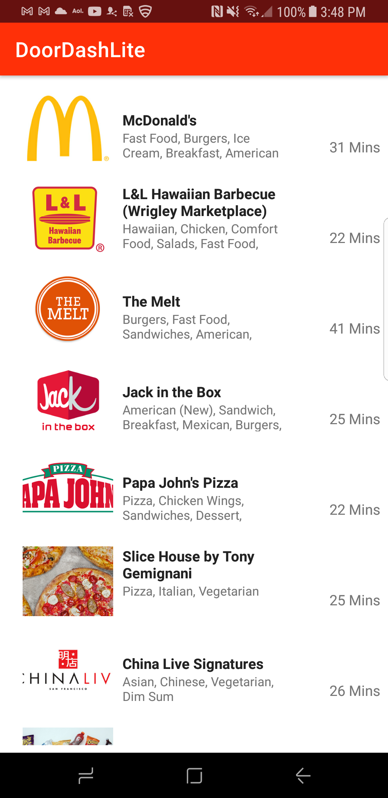

# Doordash Lite

## Feature
Doordash Lite is an Android app that has two screens: Discover and Restaurant detail.

### Discover
Users can browse a list of restaurants near DoorDash HQ (37.422740, -122.139956)

Portait                   |  Landscape
------------------------- |-------------------------
  |  

On extremly small screen(nexus one 3.7")         |
------------------------------------|
 |

### Restaurant Detail
Users can check more detailed(rating, delivery fee, etc) information of a restaurant from the list.

## Architecture
<image src="images/doordash_lite_architecture.png"/>

## Dependencis
* *Picasso*: image download and caching.
* *Retrofit2*: fetching data from web service APIs.
* Android architecture components *viewmodel*, *livedata*: MVVM pattern
* Android architecture components *recyclerview*, *paging-runtime*: fast and efficient endless scrolling list. Gradualy load restaurant data only when needed.
* *powermock*, *mockito*: stub and mock in unit tests.
